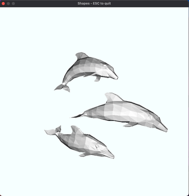

# shapes

A simplistic .ply rendering program

### Motivation

I was interested in learning Rust and thought that this program would both give me the opportunity to explore Rust's type system and other features while also learning about the math behind 3D graphics.
